React Native Application
Targets to implement
@ Create a score card with the components' competition name, date, rink number, team names and player names.
Conditions:
The number of player names can be between 1 – 4 players.
The date could be done automatically with today’s date or can be done via a Date Picker.

React native Expo app 
https://snack.expo.dev/@eliasdewan/gitlab.com-kingston-projects-reactassignment1

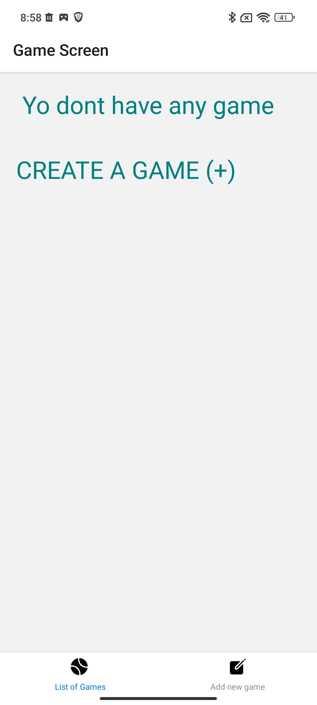
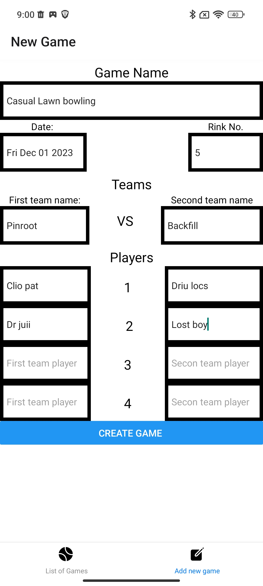
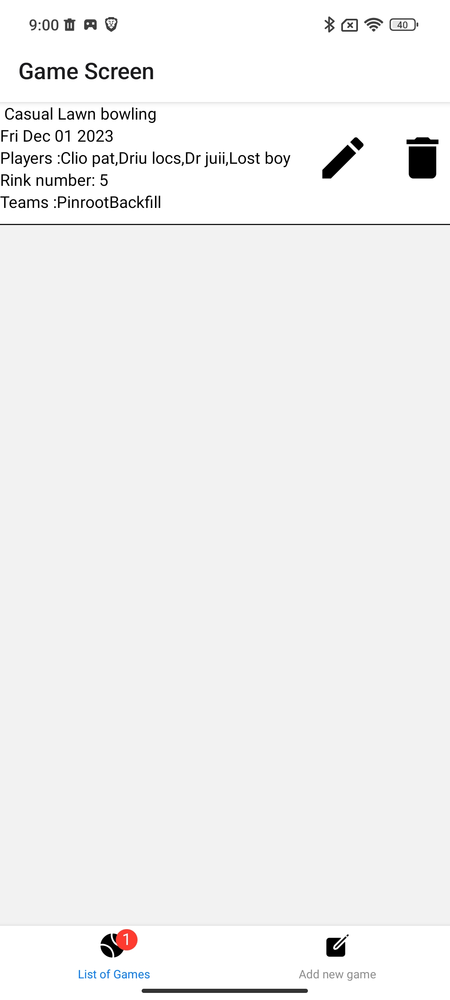  
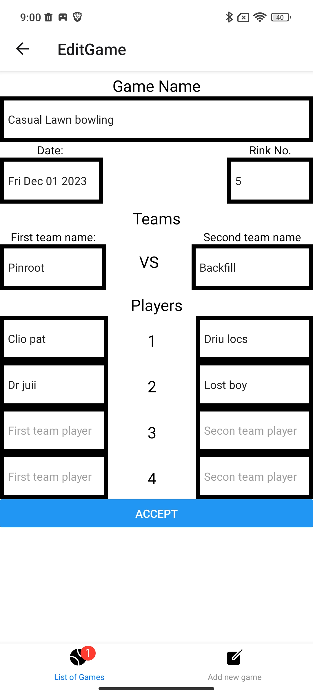 
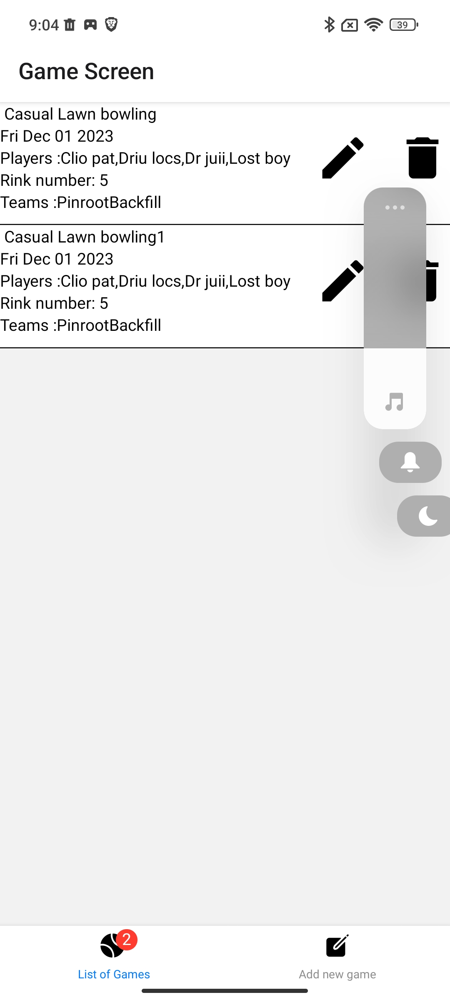
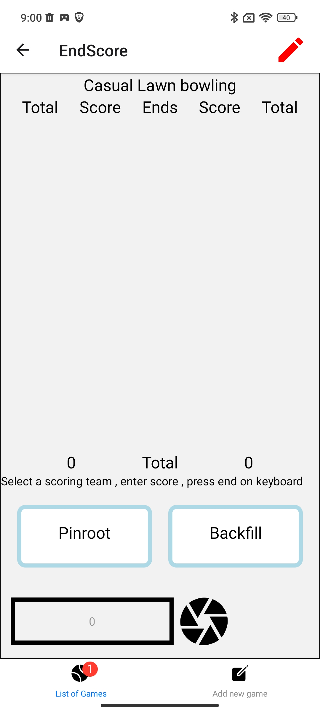
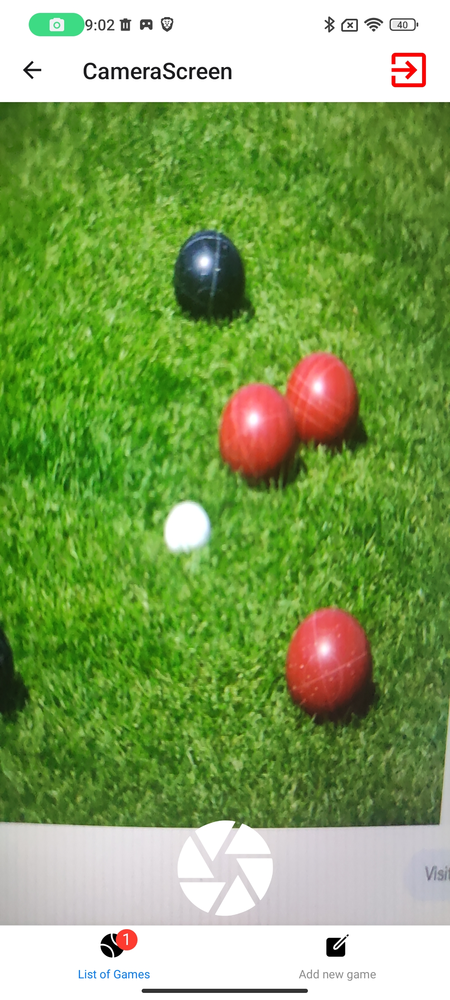
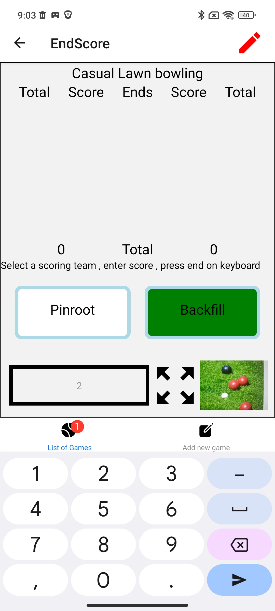
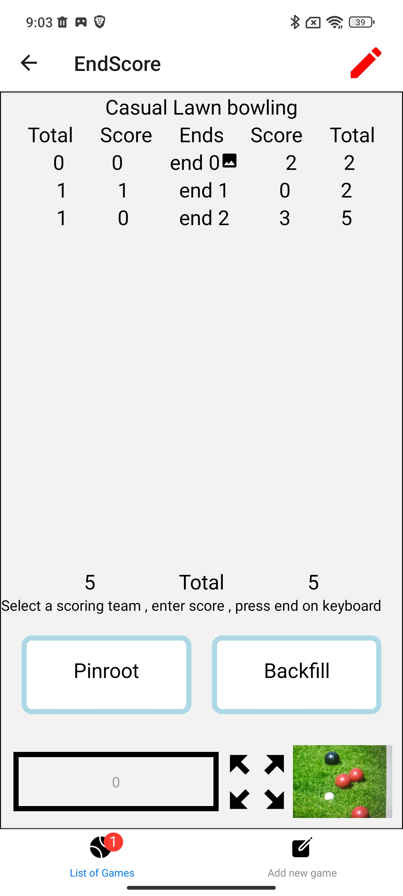
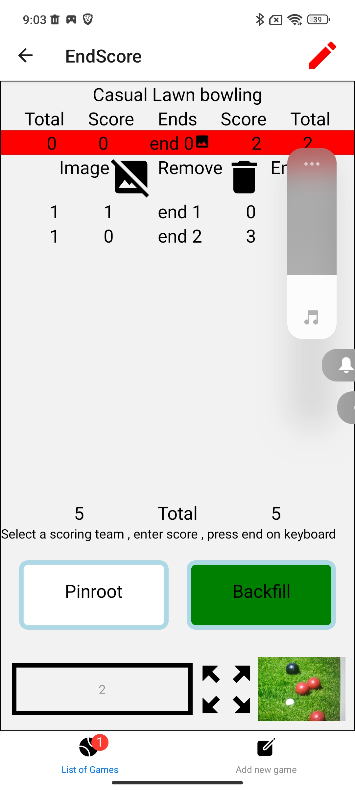
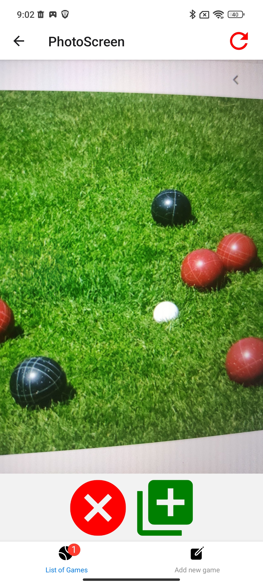
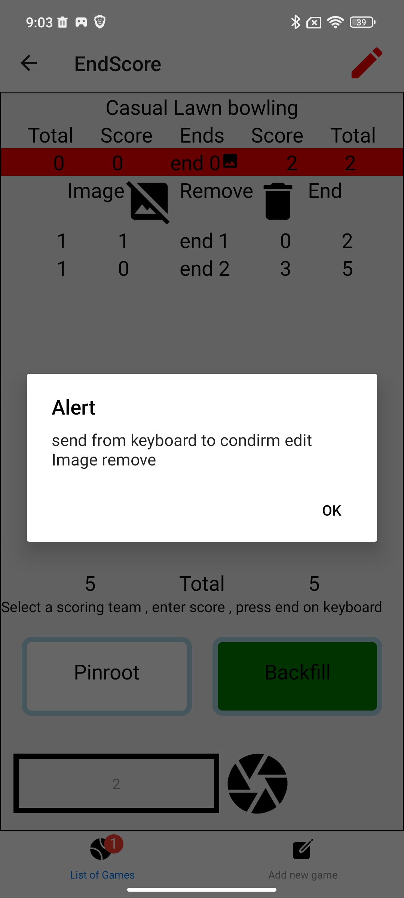
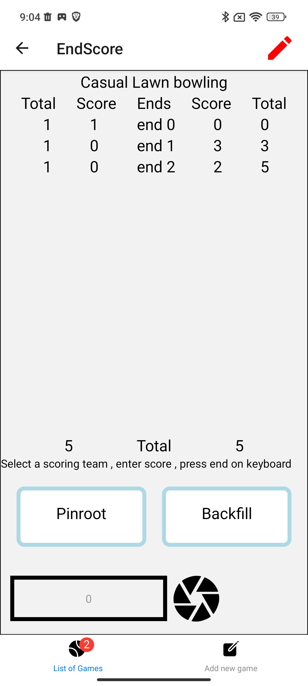
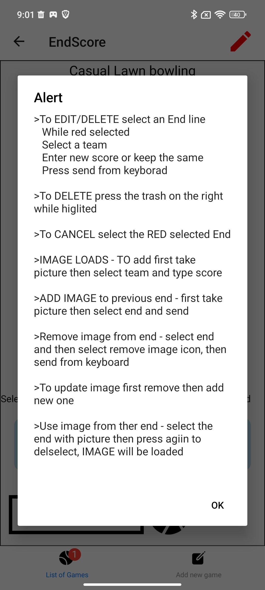

